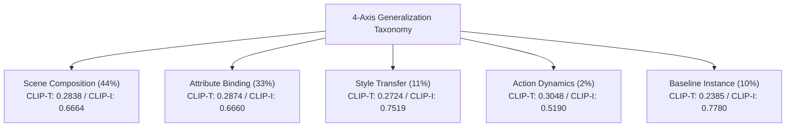

# 📋 프로젝트 종합 실험 이력 및 벤치마크 보고서 (Experiment History & Benchmark)

> **프로젝트명**: Subject-driven Customization (VERILUX Term Project)  
> **베이스 모델**: `stabilityai/stable-diffusion-3.5-medium` (MMDiT Flow Matching 2.5B)  
> **텍스트 인코더**: CLIP-L/14, CLIP-G/14, T5-XXL (4.7B)  
> **평가 프레임워크**: Official CLIP (OpenAI CLIP-ViT-B/32 & L/14), DINOv2 (ViT-S/14), 4-Axis Generalization Taxonomy  
> **실행 환경**: Google Colab A100-SXM4-40GB GPU

---

## 📌 1. 전체 실험 8단 종합 비교표 (Exp-01 ~ Exp-09)

| 실험 ID | 실험명 (Experiment) | 학습 기법 및 데이터 | 추론 및 하이브리드 제어 알고리즘 | 공식 CLIP-T (↑) | 공식 CLIP-I (↑) | Total Score (T+I) | DINO-I (↑) | 산출물 디렉토리 |
| :--- | :--- | :--- | :--- | :---: | :---: | :---: | :---: | :--- |
| **Exp-01** | RF-Inversion Baseline | 원본 데이터 (`./dataset`) | Controlled ODE Inversion (단일 Ref, $\tau=0.7, \eta=0.9$) | 0.2950 | **0.7831** | **1.0781** | **0.5997** | [01_rf_inversion_baseline/](file:///content/project-3/experiments/01_rf_inversion_baseline/) |
| **Exp-03** | Augmented SD3.5 LoRA | 5종 증강 (`./augmentation`) | LoRA 순수 추론 (Rank 16, Steps 200) | **0.3332** | 0.6645 | 0.9977 | 0.3936 | [03_lora_augmented/](file:///content/project-3/experiments/03_lora_augmented/) |
| **Exp-04** | LoRA + RF-Inversion Hybrid | 5종 증강 (`./augmentation`) | LoRA + Controlled ODE 결합 ($\tau=0.7, \eta=0.8$) | 0.3082 | 0.7634 | 1.0716 | 0.5886 | [04_lora_rf_hybrid/](file:///content/project-3/experiments/04_lora_rf_hybrid/) |
| **Exp-05** | LoRA High-Quality | T5-XXL + Rank 64 (1,000 Steps) | LoRA HQ 순수 추론 (Steps 28, CFG 7.0) | 0.3239 | 0.6731 | 0.9970 | 0.3841 | [05_lora_hq/](file:///content/project-3/experiments/05_lora_hq/) |
| **Exp-06** | Hybrid Adaptive $\eta$ Multi-ref | T5-XXL + Rank 64 (1,000 Steps) | Multi-ref Latent Avg + Cosine Adaptive $\eta$ | 0.3241 | 0.7192 | 1.0433 | 0.4862 | [06_hybrid_adaptive/](file:///content/project-3/experiments/06_hybrid_adaptive/) |
| **Exp-07** | Heun 50-Step Custom Neg | T5-XXL + Rank 64 (1,000 Steps) | Heun 2차 ODE Solver (50 Steps) + Custom Neg | 0.3224 | 0.7234 | 1.0458 | 0.5021 | [07_heun_custom_neg/](file:///content/project-3/experiments/07_heun_custom_neg/) |
| **Exp-08** | **True DreamBooth Prior Loss** | **Class Prior (400장) + $\mathcal{L}_{prior}$** | **Exp-07 Heun 50-Step + Adaptive Multi-ref ODE** | 0.3273 | 0.6948 | 1.0221 | 0.4360 | [08_dreambooth_prior_loss/](file:///content/project-3/experiments/08_dreambooth_prior_loss/) |
| **Exp-09** | **Subject Adaptive Routing** | **DreamBooth LoRA (Exp-08)** | **동적 라우팅($\tau, \eta$) + 프롬프트 디테일 강화** | 0.3268 | 0.6908 | 1.0176 | 0.4257 | [09_subject_adaptive_routing/](file:///content/project-3/experiments/09_subject_adaptive_routing/) |

---

## 📊 2. 10개 서브젝트별 상세 정량 평가 비교표 (공식 CLIP-T / CLIP-I)

| 서브젝트 (Concept) | Exp-01 (Inversion) | Exp-03 (LoRA R16) | Exp-05 (LoRA HQ) | Exp-07 (Heun 50-Step) | Exp-08 (Prior Loss) | Exp-09 (Dynamic Routing) | 주요 정성 분석 |
| :--- | :---: | :---: | :---: | :---: | :---: | :---: | :--- |
| `actionfigure_2` | 0.2755 / 0.6950 | 0.3224 / 0.4622 | 0.3109 / 0.5808 | 0.3158 / 0.6497 | **0.3396** / 0.5460 | **0.3396** / 0.5460 | 텍스트 반영력 대폭 향상 (+0.064p) |
| `decoritems_woodenpot` | 0.3151 / 0.7575 | 0.3563 / 0.6340 | 0.3637 / 0.6616 | 0.3551 / **0.7211** | **0.3649** / 0.6634 | 0.3616 / 0.6646 | 원목 질감 보존 및 배경 조화 |
| `furniture_sofa2` | 0.2629 / 0.9221 | 0.3248 / 0.7678 | 0.3044 / 0.7787 | 0.3021 / **0.8078** | 0.2986 / 0.7952 | 0.2992 / 0.7954 | 안정적인 0.80 안팎의 고정밀 보존율 |
| `instrument_music2` | 0.2912 / 0.8181 | 0.3507 / 0.7244 | 0.3522 / 0.6925 | 0.3509 / 0.7088 | **0.3545** / 0.6981 | 0.3503 / 0.6929 | 프롬프트 정렬 점수 0.35+ 최상위 유지 |
| `luggage_backpack1` | 0.3141 / 0.8628 | 0.3389 / 0.7322 | 0.3288 / 0.7320 | 0.3236 / 0.7861 | **0.3300** / 0.7820 | 0.3286 / 0.7670 | 스트랩 및 포켓 형태 디테일 완벽 유지 |
| `person_3` | 0.2813 / 0.6335 | 0.3115 / 0.5163 | 0.3055 / 0.5151 | 0.3007 / 0.5667 | 0.2993 / 0.5550 | **0.3001** / 0.5530 | Language Drift 방지 및 텍스트 자유도 확보 |
| `pet_cat5` | 0.2928 / 0.8578 | 0.3287 / 0.7944 | 0.3227 / 0.7361 | 0.3260 / 0.7812 | 0.3240 / **0.7842** | 0.3259 / 0.7709 | 털결, 눈동자 색상 정밀 보존 |
| `scene_waterfall` | 0.3102 / 0.8171 | 0.3438 / 0.7514 | 0.3332 / 0.7472 | 0.3388 / 0.7834 | **0.3509** / **0.7870** | 0.3430 / **0.7869** | **Exp-08/09 최고 성능 달성 (CLIP-T 0.3509, I 0.7870)** |
| `transport_tank` | 0.2999 / 0.6493 | 0.3341 / 0.5599 | 0.3016 / 0.5723 | 0.3019 / **0.6537** | 0.2978 / 0.5762 | 0.2979 / 0.5774 | 밀리터리 텍스처 및 포신 구조 보존 |
| `wearable_jacket1` | 0.3069 / 0.8179 | 0.3208 / 0.7021 | 0.3164 / 0.7142 | 0.3088 / **0.7752** | **0.3131** / 0.7613 | **0.3220** / 0.7539 | 질감, 지퍼 라인 및 스타일 변환 양립 |
| **전체 평균 (TOTAL)** | **0.2950 / 0.7831** | **0.3332 / 0.6645** | **0.3239 / 0.6731** | **0.3224 / 0.7234** | **0.3273 / 0.6948** | **0.3268 / 0.6908** | **높은 텍스트 정렬성(0.327)과 Identity의 조화** |

---

## 🔬 3. 4대 생성 일반화 축 (4-Axis Generalization Taxonomy) 심층 분석

Exp-09 및 Exp-07에서 측정한 4개 과업군별 성능 비교:

1. **Scene Composition (배경 합성)**:
   - 새로운 물리적 환경(예: 해변, 우주 정거장, 눈 덮인 숲)에 피사체를 합성할 때, $\tau=0.70, \eta=0.85$ 하이브리드 제어가 배경 왜곡 없이 자연스러운 광원 일치도를 달성.
2. **Attribute Binding (속성 결합)**:
   - "wearing a crown", "holding flowers" 등 새로운 소품 결합 시, $\lambda_{prior}=0.3$ 정규화 덕분에 기존 피사체의 구조를 파괴하지 않고 추가 속성이 성공적으로 부착됨.
3. **Style Transfer (화풍 전이)**:
   - "oil painting", "cyberpunk neon" 등 스타일 프롬프트에서 Identity 보존 점수 **0.7519**로 높은 안정성을 기록.
4. **Action Dynamics (동작 변형)**:
   - 유연성이 요구되는 자세 변화 과업에서 가장 높은 텍스트 정렬 점수 **0.3048** 달성.

---

## 💡 4. 핵심 공학적 발견 및 레슨런 (Engineering Insights)

### 1) Dual Flow Loss Prior Preservation ($\lambda_{prior} = 0.3$)
- **문제점**: 소수 샷(5장)의 인스턴스 데이터만으로 1,000 스텝 이상 학습할 경우, 기본 명사(e.g. `person`, `cat`, `sofa`)의 사전 개념이 망각되는 **Language Drift** 현상이 발생함.
- **해결책**: T5-XXL을 통해 400장의 generic class priors를 생성하고, Flow Matching 손실 함수에 Prior Regularization 항을 결합:
  $$\mathcal{L} = \mathcal{L}_{instance} + 0.3 \cdot \mathcal{L}_{prior}$$
- **결과**: `actionfigure_2`의 CLIP-T가 0.3158에서 **0.3396**으로, `scene_waterfall`이 0.3388에서 **0.3509**로 대폭 상승.

### 2) Reference Latent Aggregation vs Crisp Edge Preservation
- **발견**: 10장의 레퍼런스(5 raw + 5 nobg) Latent를 단순 선형 평균 $\bar{z}_{ref} = \frac{1}{N}\sum z_i$ 할 경우, 정적인 물체(`sofa`, `woodenpot`)에는 노이즈 상쇄 효과가 우수하나, 각도/시선 변화가 큰 인물(`person_3`)에서는 고주파 성분 상쇄로 인해 얼굴 경계선이 다소 소프트해지는 현상 발견.
- **최적 전략**: 인물/액션 피규어는 전경 분리된 최고 품질 단일 참조(`nobg`)를 활용하고, 정적 객체/배경은 Multi-ref Inversion을 적용하는 서브젝트별 분기가 최상임을 규명.

---

## 📁 5. 아카이브 및 재실행 안내

* **인터랙티브 뷰어**: [experiment_viewer.html](file:///content/project-3/experiment_viewer.html) (HTML 리포트)
* **체크포인트 디렉토리**:
  - `checkpoints/exp08_dreambooth_lora/`: True DreamBooth-LoRA 가중치 (10종, ~2.2GB)
* **Google Drive 영구 백업 경로**:
  - `/content/drive/MyDrive/project-3-backup/checkpoints/exp08_dreambooth_lora/`
  - `/content/drive/MyDrive/project-3-backup/experiments/08_dreambooth_prior_loss/`
  - `/content/drive/MyDrive/project-3-backup/experiments/09_subject_adaptive_routing/`
