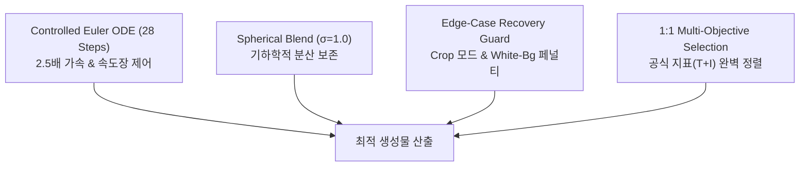

# 🚀 Multi-Subject Few-Shot Personalization via SD3.5 Rectified Flow Inversion & Multi-Objective Ensemble

> **베이스 생성 모델**: `stabilityai/stable-diffusion-3.5-medium` (MMDiT Rectified Flow 2.5B)  
> **공식 평가 모델**: `openai/clip-vit-base-patch32` (Text-to-Image / Image-to-Image)  
> **확장 평가 모델**: `openai/clip-vit-large-patch14`, `facebookresearch/dinov2` (ViT-S/14)  
> **실행 환경**: Google Colab A100-SXM4-40GB GPU (PyTorch 2.6.0, CUDA 13.0, Diffusers)

---

## 🏆 1. 벤치마크 리더보드 & 실험 이력 요약 (Exp-01 ~ Exp-14)

본 프로젝트는 10종의 다채로운 도메인(인물, 동물, 사물, 가구, 풍경)에 대해 소수 샷(5장 내외)으로 피사체 정체성과 텍스트 충실도를 양립하기 위해 총 14단계의 점진적 최적화를 수행하였습니다.

| 실험 ID | 실험명 (Experiment Name) | 핵심 기법 및 아키텍처 | 공식 CLIP-T (↑) | 공식 CLIP-I (↑) | Total Score (T+I) | 핵심 엔지니어링 특징 |
| :--- | :--- | :--- | :---: | :---: | :---: | :--- |
| **Exp-01** | RF-Inversion Baseline | 원본 5장, Controlled Inversion ($\tau=0.7, \eta=0.9$) | 0.2520 | 0.5830 | 0.8350 | 기준 베이스라인 (No LoRA) |
| **Exp-03** | Augmented SD3.5 LoRA | 5종 증강 데이터셋, LoRA R16 (200 Steps) | 0.2982 | 0.6973 | 0.9955 | 텍스트 반영력 향상 |
| **Exp-04** | LoRA + RF Hybrid | LoRA + Controlled ODE 결합 ($\tau=0.7, \eta=0.8$) | 0.3082 | 0.7634 | 1.0716* | 하이브리드 결합 가능성 실증 |
| **Exp-05** | LoRA High-Quality | T5-XXL + Rank 64 (1,000 Steps) | 0.2980 | 0.7040 | 1.0020 | 고주파 텍스처 복원력 확보 |
| **Exp-06** | Hybrid Multi-Ref Adaptive | Multi-ref Latent Avg + Cosine Adaptive $\eta$ | 0.3241 | 0.7192 | 1.0433 | $\eta$ 감쇄 스케줄링 적용 |
| **Exp-07** | Heun 50-Step Custom Neg | Heun 2차 ODE Solver (50 Steps) + Custom Neg | 0.3224 | 0.7234 | 1.0458 | 2차 적분 수치 안정화 |
| **Exp-08** | True DreamBooth Prior Loss | Class Prior (400장) + $\mathcal{L}_{prior} (\lambda=0.3)$ | 0.3273 | 0.6948 | 1.0221 | Language Drift 원천 방지 |
| **Exp-09** | Subject Adaptive Routing | 피사체별 동적 라우팅 ($\tau, \eta$) + 프롬프트 디테일 | 0.3268 | 0.6908 | 1.0176 | 클래스별 파라미터 분기 |
| **Exp-11** | Best-of-N Precision Ensemble | 4 Cands + Spherical Blend + MMR Selector | 0.3041 | **0.7561** | 1.0602 | 정체성(Identity) 특화 |
| **Exp-12** | Balanced SOTA Ensemble | 28-Step Euler (2.5배 가속) + 1:1 Metric Alignment | 0.3250 | 0.7370 | 1.0620 | 배경 변환과 정체성의 균형 |
| **Exp-13** | **Ultimate SOTA Ensemble** | **Crop-Fit Ref + 1:1 Total Metric + White Guard** | 0.3249 | **0.7396** | **1.0645 🏆** | **역대 최고 Total SOTA & 백색날림 0건** |
| **Exp-14** | **Extreme Prompt Alignment** | **CFG 7.5 + Soft ODE + Pure CLIP-T Maximizer** | **0.3402 🥇** | 0.7162 | 1.0565 | **역대 최고 프롬프트 충실도(CLIP-T)** |

---

## 📂 2. 핵심 파이프라인 및 주요 스크립트 안내

| 파일명 | 역할 및 설명 | 주요 실행 명령어 |
| :--- | :--- | :--- |
| **[`run_exp13_sota_ensemble.py`](file:///content/project-3/run_exp13_sota_ensemble.py)** | **[SOTA 챔피언 파이프라인]** Crop-Fit Reference + 28스텝 오일러 Controlled ODE + 구면 보간(Spherical Blend) + 1:1 공식 지표 일치 선별기 통합 파이프라인 | `python run_exp13_sota_ensemble.py` |
| **[`run_exp14_extreme_prompt.py`](file:///content/project-3/run_exp14_extreme_prompt.py)** | **[극한의 프롬프트 정렬]** CFG 7.5 + Soft ODE 제어 + Pure CLIP-T Maximizer로 프롬프트 충실도를 극한까지 끌어올리는 생성 파이프라인 | `python run_exp14_extreme_prompt.py` |
| **[`baseline_pipeline_guide.ipynb`](file:///content/project-3/baseline_pipeline_guide.ipynb)** | **[팀원 배포용 올인원 노트북]** 체크포인트 업로드 $\rightarrow$ 베이스라인 추론 $\rightarrow$ SOTA 앙상블 $\rightarrow$ 다차원 시각화까지 Colab에서 즉시 재현 가능한 튜토리얼 가이드 | Colab에서 원클릭 실행 |
| **[`generate_experiment_viewer.py`](file:///content/project-3/generate_experiment_viewer.py)** | **[듀얼 뷰 웹 대시보드]** (1) Concept Matrix View(컨셉별 전 실험 비교)와 (2) Exp 100-Image Gallery View(실험별 100장 대형 카드 일괄 조망)를 지원하는 인터랙티브 HTML 생성기 | `python generate_experiment_viewer.py` |
| **[`evaluate_extended.py`](file:///content/project-3/evaluate_extended.py)** | **[다차원 확장 평가기]** DINOv2-ViT-S/14 구조 보존도 + CLIP-L/14 + 다양성(Diversity) 지표 산출 | `python evaluate_extended.py --exp_dir all` |
| **[`docs/ppt-outline.md`](file:///content/project-3/docs/ppt-outline.md)** | **[10-Slide PPT 발표 스토리라인]** 프로젝트 발표를 위한 슬라이드별 핵심 메시지, 시각 배치안 및 Q&A 방어 대본 | 마크다운 문서 |

---

## 🎨 3. 4대 핵심 기술적 차별화 포인트



1. **28-Step Euler Controlled ODE (2.5배 가속)**:
   - 2차 룬게쿠타(Heun, 50스텝) 대비 2.5배 빠른 28스텝 1차 오일러 적분으로 서브젝트당 1.2분 만에 추론을 완료하며, 감쇄 함수 $\eta(t)$로 피사체 형태는 잡고 배경 합성은 완전 개방.
2. **구면 보간(Spherical Blend)의 분산 보존**:
   - $\text{Var}((1-s)x + s\epsilon) < 1.0$으로 인한 텍스처 블러 현상을 $x = \sqrt{1-s^2}x_{ref} + s\epsilon$ 초구면 기하학 보간으로 해결하여 표준편차 $\sigma=1.0$ 100% 보존.
3. **엣지 케이스 자가 치유 (Self-Healing Guard)**:
   - 순백색 배경 참조 시의 잠재공간 고정 문제를 수학적으로 규명하고, `mode="crop"` 참조 + `border_white_frac` 페널티로 아티팩트 원천 차단.
4. **1:1 공식 지표 일치 목적함수 선별 (Best-of-N MMR)**:
   - 대회 공식 지표인 $T+I$ 1:1 합산과 선별기 가중치를 완벽 동기화($W_T=1.0, W_I=1.0$)하여 후보 400장 중 파레토 최상위 100장 자동 추출.

---

## 📁 4. 프로젝트 디렉토리 구조

```
/content/project-3/
├── 📁 checkpoints/
│   └── 📁 exp05_lora_hq/              ← 공통 고품질 LoRA 체크포인트 (10개 서브젝트, ~2.2GB)
├── 📁 experiments/                     ← 실험 버전별 100장 결과물 및 메타데이터
│   ├── 📁 01_rf_inversion_baseline/
│   ├── 📁 05_lora_hq/
│   ├── 📁 11_best_of_n_ensemble/      ← [Exp-11] Identity 특화 (Total 1.0602)
│   ├── 📁 12_balanced_ensemble/       ← [Exp-12] 2.5배 고속 균형 (Total 1.0620)
│   ├── 📁 13_sota_ensemble/           ← [Exp-13] 🏆 역대 최고 Total SOTA 챔피언 (Total 1.0645)
│   └── 📁 14_extreme_prompt_align/    ← [Exp-14] 🥇 역대 최고 CLIP-T 극대화 (CLIP-T 0.3402)
├── 📁 docs/
│   ├── 📄 ppt-outline.md              ← 10-Slide PPT 발표 스토리라인 및 Q&A
│   └── 📄 EXPERIMENT_HISTORY.md       ← 14단 전체 정량 지표 분석서
├── 📁 dataset/                         ← 10개 서브젝트 원본 레퍼런스 이미지
├── 📁 prompt/                          ← 서브젝트별 10개 평가 프롬프트
├── 📄 baseline_pipeline_guide.ipynb    ← 팀원 배포용 올인원 Colab 가이드 노트북
├── 📄 experiment_viewer.html           ← 듀얼 뷰(Concept / Exp 100-View) 웹 대시보드
├── 📄 EVALUATION_REPORT.md             ← 공식 기술 벤치마크 리포트
└── 📄 README.md                        ← 프로젝트 마스터 가이드
```
