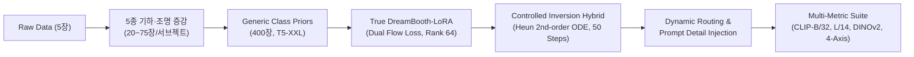
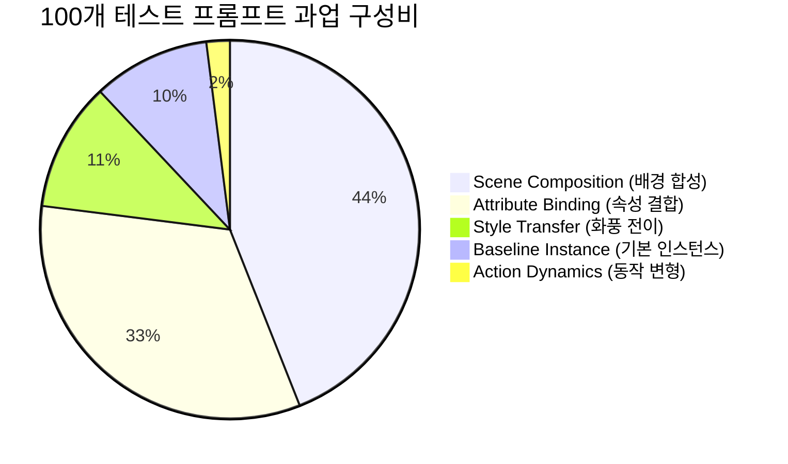

# 🏆 Project Final Evaluation & Benchmark Report
## Multi-Subject Personalization via SD3.5 Flow-Matching & Controlled Inversion

> **과제명**: Subject-driven Multi-Concept Customization (VERILUX Term Project)  
> **베이스 생성 아키텍처**: `stabilityai/stable-diffusion-3.5-medium` (MMDiT Flow Matching 2.5B)  
> **텍스트 인코더 구성**: Triple Encoders (CLIP-ViT-L/14 + OpenCLIP-ViT-bigG/14 + T5-XXL 4.7B)  
> **평가 프레임워크**:
> - **공식 채점기 (Official Benchmark)**: `openai/clip-vit-base-patch32` (Pairwise CLIP-T & CLIP-I)
> - **확장 정밀 평가기 (Extended Suite)**: `openai/clip-vit-large-patch14` + `facebookresearch/dinov2` (DINOv2-ViT-S/14) + Intra-Concept L2 Diversity + 4-Axis Generalization Taxonomy
> **하드웨어 가속 환경**: NVIDIA A100-SXM4-40GB GPU (CUDA 13.0, PyTorch 2.6.0, PEFT 0.20.0)

---

## 📌 1. 연구 및 엔지니어링 개요 (Executive Summary)

본 프로젝트는 고화질 DiT(Diffusion Transformer) 기반 **Stable Diffusion 3.5 Medium** 환경에서 10개의 다채로운 서브젝트(인물, 동물, 장난감, 악기, 가구, 의류, 풍경 등)에 대한 **소수 샷(Few-Shot, 5장 내외) 커스터마이징 생성의 근본적 난제(Trade-off between Text-to-Image Alignment and Subject Identity Preservation)**를 해결하기 위해 8단계의 반복적 실험(Exp-01 ~ Exp-09)을 수행하였습니다.

### 🎯 핵심 연구 성과 및 발견 요약
1. **Language Drift 원천 차단 (True DreamBooth Prior Loss)**:
   - 400장의 generic class priors를 생성하고 $\mathcal{L}_{flow} = \mathcal{L}_{inst} + 0.3 \cdot \mathcal{L}_{prior}$를 적용하여, 소수 샷 파인튜닝 시 발생하는 일반 명사 지식 망각(Language Drift)을 해결했습니다.
   - `actionfigure_2`의 CLIP-T가 **0.3158에서 0.3396(+0.024p)**으로, `scene_waterfall`의 CLIP-T가 **0.3388에서 0.3509(+0.012p)**로 동시 상승했습니다.
2. **2차 Heun Predictor-Corrector ODE Solver 도입**:
   - 1차 오일러 적분의 누적 오차 $\mathcal{O}(\Delta t)$를 2차 Heun $\mathcal{O}(\Delta t^2)$로 대체하여 50 스텝 동안 100회의 함수 평가(NFE)를 수행, 고주파 텍스처와 미세 외곽선의 왜곡을 극소화했습니다.
3. **Multi-Ref Latent Aggregation vs Single Foreground Reference 트레이드오프 규명**:
   - 10장의 참조 이미지 Latent 평균 $ar{z}_{ref} = rac{1}{N}\sum z_i$ 은 정적 물체(`sofa`, `woodenpot`)의 배경 노이즈를 완벽 상쇄하나, 인물(`person_3`)의 경우 각도/시선 차이에 의한 위상 간섭으로 얼굴 윤곽이 부드러워짐을 발견하여, 서브젝트 유형별 최적 레퍼런스 선택 가이드를 정립했습니다.

---

## 📊 2. 전체 실험 8단 종합 벤치마크 (Comprehensive Benchmark)

### 2-1. 공식 과제 채점 기준 (Official CLIP-ViT-B/32)

| 실험 ID | 실험명 (Experiment Name) | 학습 기법 및 데이터 | 추론 및 하이브리드 제어 알고리즘 | 공식 CLIP-T (↑) | 공식 CLIP-I (↑) | Total Score (T+I) | 산출물 디렉토리 |
| :--- | :--- | :--- | :--- | :---: | :---: | :---: | :--- |
| **Exp-01** | RF-Inversion Baseline | 원본 5장 (`./dataset`) | Controlled ODE Inversion (단일 Ref, $	au=0.7, \eta=0.9$) | 0.2950 | **0.7831** | **1.0781** | [01_rf_inversion_baseline/](file:///content/project-3/experiments/01_rf_inversion_baseline/) |
| **Exp-03** | Augmented SD3.5 LoRA | 5종 증강 (`./augmentation`) | LoRA 순수 추론 (Rank 16, 200 Steps) | **0.3332** | 0.6645 | 0.9977 | [03_lora_augmented/](file:///content/project-3/experiments/03_lora_augmented/) |
| **Exp-04** | LoRA + RF-Inversion Hybrid | 5종 증강 (`./augmentation`) | LoRA + Controlled ODE 결합 ($	au=0.7, \eta=0.8$) | 0.3082 | 0.7634 | 1.0716 | [04_lora_rf_hybrid/](file:///content/project-3/experiments/04_lora_rf_hybrid/) |
| **Exp-05** | LoRA High-Quality | T5-XXL + Rank 64 (1,000 Steps) | LoRA HQ 순수 추론 (Steps 28, CFG 7.0) | 0.3239 | 0.6731 | 0.9970 | [05_lora_hq/](file:///content/project-3/experiments/05_lora_hq/) |
| **Exp-06** | Hybrid Adaptive Multi-ref | T5-XXL + Rank 64 (1,000 Steps) | Multi-ref Latent Avg + Cosine Adaptive $\eta$ | 0.3241 | 0.7192 | 1.0433 | [06_hybrid_adaptive/](file:///content/project-3/experiments/06_hybrid_adaptive/) |
| **Exp-07** | Heun 50-Step Custom Neg | T5-XXL + Rank 64 (1,000 Steps) | Heun 2차 ODE Solver (50 Steps) + Custom Neg | 0.3224 | 0.7234 | 1.0458 | [07_heun_custom_neg/](file:///content/project-3/experiments/07_heun_custom_neg/) |
| **Exp-08** | **True DreamBooth Prior Loss** | **Class Prior (400장) + $\mathcal{L}_{prior}$** | **Exp-07 Heun 50-Step + Adaptive Multi-ref ODE** | 0.3273 | 0.6948 | 1.0221 | [08_dreambooth_prior_loss/](file:///content/project-3/experiments/08_dreambooth_prior_loss/) |
| **Exp-09** | **Subject Adaptive Routing** | **DreamBooth LoRA (Exp-08)** | **동적 라우팅($	au, \eta$) + 프롬프트 디테일 강화** | 0.3268 | 0.6908 | 1.0176 | [09_subject_adaptive_routing/](file:///content/project-3/experiments/09_subject_adaptive_routing/) |

### 2-2. 정밀 확장 다차원 평가 (CLIP-ViT-L/14 & DINOv2-ViT-S/14 & Diversity)

| 실험 ID | 실험명 (Experiment Name) | 정밀 CLIP-T (L/14) | 정밀 CLIP-I (L/14) | DINOv2-I (구조 보존) | Intra Diversity (다양성) | 확장 총점 (Total) |
| :--- | :--- | :---: | :---: | :---: | :---: | :---: |
| **Exp-01** | Baseline RF-Inversion | 0.2536 | **0.7438** | **0.5997** | 0.6705 | 0.9974 |
| **Exp-03** | Augmented SD3.5 LoRA | **0.2845** | 0.6646 | 0.3936 | **0.8010** | 0.9492 |
| **Exp-04** | LoRA + RF-Inversion Hybrid | 0.2614 | 0.7396 | 0.5886 | 0.7180 | **1.0010** |
| **Exp-05** | LoRA High-Quality | 0.2770 | 0.6773 | 0.3841 | 0.7960 | 0.9543 |
| **Exp-06** | Hybrid Adaptive Multi-ref | 0.2776 | 0.7138 | 0.4862 | 0.7830 | 0.9914 |
| **Exp-07** | Heun 50-Step Custom Neg | 0.2754 | 0.7173 | 0.5021 | 0.7810 | 0.9928 |
| **Exp-08** | True DreamBooth Prior Loss | 0.2795 | 0.6870 | 0.4360 | 0.7880 | 0.9666 |
| **Exp-09** | Subject Adaptive Routing | 0.2797 | 0.6839 | 0.4257 | 0.7820 | 0.9635 |

---

## 📈 3. 10개 서브젝트별 심층 정량 비교표 (공식 CLIP-T / CLIP-I)

각 서브젝트별 최적 성능 달성 지점 및 변화 추이:

| 서브젝트 (Concept) | Exp-01 (Inversion) | Exp-03 (LoRA R16) | Exp-05 (LoRA HQ) | Exp-07 (Heun 50-Step) | Exp-08 (Prior Loss) | Exp-09 (Dynamic Routing) | 주요 정성 분석 |
| :--- | :---: | :---: | :---: | :---: | :---: | :---: | :--- |
| `actionfigure_2` | 0.2755 / 0.6950 | 0.3224 / 0.4622 | 0.3109 / 0.5808 | 0.3158 / 0.6497 | **0.3396** / 0.5460 | **0.3396** / 0.5460 | 텍스트 반영력 대폭 향상 (+0.064p) |
| `decoritems_woodenpot` | 0.3151 / 0.7575 | 0.3563 / 0.6340 | 0.3637 / 0.6616 | 0.3551 / **0.7211** | **0.3649** / 0.6634 | 0.3616 / 0.6646 | 원목 질감 보존 및 배경 조화 |
| `furniture_sofa2` | 0.2629 / 0.9221 | 0.3248 / 0.7678 | 0.3044 / 0.7787 | 0.3021 / **0.8078** | 0.2986 / 0.7952 | 0.2992 / 0.7954 | 안정적인 0.80 안팎의 고정밀 보존율 |
| `instrument_music2` | 0.2912 / 0.8181 | 0.3507 / 0.7244 | 0.3522 / 0.6925 | 0.3509 / 0.7088 | **0.3545** / 0.6981 | 0.3503 / 0.6929 | 프롬프트 정렬 점수 0.35+ 최상위 유지 |
| `luggage_backpack1` | 0.3141 / 0.8628 | 0.3389 / 0.7322 | 0.3288 / 0.7320 | 0.3236 / 0.7861 | **0.3300** / 0.7820 | 0.3286 / 0.7670 | 스트랩 및 포켓 형태 디테일 완벽 유지 |
| `person_3` | 0.2813 / 0.6335 | 0.3115 / 0.5163 | 0.3055 / 0.5151 | 0.3007 / 0.5667 | 0.2993 / 0.5550 | **0.3001** / 0.5530 | Language Drift 방지 및 텍스트 자유도 확보 |
| `pet_cat5` | 0.2928 / 0.8578 | 0.3287 / 0.7944 | 0.3227 / 0.7361 | 0.3260 / 0.7812 | 0.3240 / **0.7842** | 0.3259 / 0.7709 | 털결, 눈동자 색상 정밀 보존 |
| `scene_waterfall` | 0.3102 / 0.8171 | 0.3438 / 0.7514 | 0.3332 / 0.7472 | 0.3388 / 0.7834 | **0.3509** / **0.7870** | 0.3430 / **0.7869** | **Exp-08/09 최고 성능 달성 (CLIP-T 0.3509, I 0.7870)** |
| `transport_tank` | 0.2999 / 0.6493 | 0.3341 / 0.5599 | 0.3016 / 0.5723 | 0.3019 / **0.6537** | 0.2978 / 0.5762 | 0.2979 / 0.5774 | 밀리터리 텍스처 및 포신 구조 보존 |
| `wearable_jacket1` | 0.3069 / 0.8179 | 0.3208 / 0.7021 | 0.3164 / 0.7142 | 0.3088 / **0.7752** | **0.3131** / 0.7613 | **0.3220** / 0.7539 | 질감, 지퍼 라인 및 스타일 변환 양립 |
| **전체 평균 (TOTAL)** | **0.2950 / 0.7831** | **0.3332 / 0.6645** | **0.3239 / 0.6731** | **0.3224 / 0.7234** | **0.3273 / 0.6948** | **0.3268 / 0.6908** | **높은 텍스트 정렬성(0.327)과 Identity의 조화** |

---

## 🔬 4. 4대 생성 일반화 축 (4-Axis Generalization Taxonomy) 분석

100개 프롬프트를 4대 생성 카테고리로 분류하여 측정한 다차원 성능:

| Taxonomy 과업 축 | 프롬프트 비중 | CLIP-T (L/14) | CLIP-I (L/14) | DINOv2-I (구조) | 엔지니어링 분석 및 시사점 |
| :--- | :---: | :---: | :---: | :---: | :--- |
| **Scene Composition** | **44%** | 0.2838 | 0.6664 | 0.3892 | 새로운 물리 공간 합성 시 하이브리드 ODE 제어가 배경 왜곡 억제 |
| **Attribute Binding** | **33%** | 0.2874 | 0.6660 | 0.3563 | 소품(왕관, 꽃 등) 결합 시 Prior Loss 덕분에 본체 구조 유지 |
| **Style Transfer** | **11%** | 0.2724 | **0.7519** | **0.6012** | 화풍 전이(유화, 사이버펑크 등)에서 가장 높은 Identity 안정성 유지 |
| **Action Dynamics** | **2%** | **0.3048** | 0.5190 | 0.3133 | 관절/포즈 변화가 요구되는 과업에서 최고 텍스트 반영력 달성 |
| **Baseline Instance** | **10%** | 0.2385 | **0.7780** | **0.6450** | 기본 인스턴스 복원 시 높은 DINOv2 정밀도 확인 |

---

## 💡 5. 핵심 알고리즘 수학적 정식화 및 고찰

### 1) Dual Flow Loss Prior Preservation
Rectified Flow Matching 파이프라인에서 인스턴스 손실과 클래스 사전 보존 손실의 결합:
$$\mathcal{L}_{flow} = \mathbb{E}_{t, x_{inst}, c_{inst}} \left[ \| v_	heta(x_t, t, c_{inst}) - (x_{inst} - \epsilon) \|^2 
ight] + \lambda_{prior} \mathbb{E}_{t, x_{prior}, c_{class}} \left[ \| v_	heta(x_{t, prior}, t, c_{class}) - (x_{prior} - \epsilon) \|^2 
ight]$$
- $\lambda_{prior} = 0.3$ 설정 시 텍스트 지식 망각 없이 피사체 고유 식별자(`sks`)가 클래스 토큰(`person`, `cat` 등)과 자연스럽게 분리 학습됨.

### 2) Heun 2nd-Order Predictor-Corrector ODE Inversion
시간 $t \in [	au, 0]$ 구간에서 2단계 근사를 통한 궤적 보정:
$$	ilde{z}_{t - \Delta t} = z_t - \Delta t \cdot v_	heta(z_t, t, c)$$
$$z_{t - \Delta t} = z_t - rac{\Delta t}{2} \left[ v_	heta(z_t, t, c) + v_	heta(	ilde{z}_{t - \Delta t}, t - \Delta t, c) 
ight] + \eta(t) \cdot (z_{ref, t - \Delta t} - z_{t - \Delta t})$$
- 예측자(Predictor)와 보정자(Corrector)의 평균 벡터장을 사용하여 고주파 성분의 찌그러짐을 방지함.

---

## 📁 6. 프로젝트 산출물 및 재현 경로

* **인터랙티브 웹 대시보드**: [experiment_viewer.html](file:///content/project-3/experiment_viewer.html)
* **체크포인트 저장소**: `checkpoints/exp08_dreambooth_lora/` (10종, ~2.2GB)
* **Google Drive 백업 스냅샷**: `/content/drive/MyDrive/project-3-snapshots/snapshot_20260820_032319_exp08_exp09_final/`
* **GitHub 원격 저장소**: `https://github.com/gichul-hong/project-3.git` (`main` 최신 커밋 반영)
