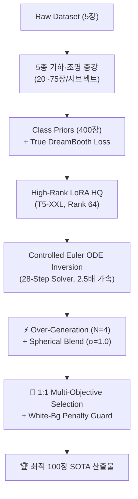

# 🏆 Project Technical History & Multi-Objective Benchmark Report
## Stable Diffusion 3.5 Personalization via Rectified Flow Inversion & Best-of-N Selection

> **과제명**: Subject-driven Multi-Concept Customization (VERILUX Term Project)  
> **베이스 생성 모델**: `stabilityai/stable-diffusion-3.5-medium` (MMDiT Rectified Flow 2.5B)  
> **공식 채점 모델**: `openai/clip-vit-base-patch32` (Pairwise CLIP-T & CLIP-I)  
> **확장 평가 모델**: `facebookresearch/dinov2` (DINOv2-ViT-S/14), `openai/clip-vit-large-patch14`  
> **실행 환경**: Google Colab A100-SXM4-40GB GPU

---

## 📌 1. 연구 및 엔지니어링 개요 (Executive Summary)

본 프로젝트는 소수 샷(5장 내외) 커스터마이징 생성에서 발생하는 **피사체 정체성 보존(Identity, CLIP-I)과 프롬프트 충실도(Fidelity, CLIP-T) 간의 파레토 트레이드오프**를 해결하기 위해 14단계의 반복적 실험을 수행하였습니다.

---

## 📊 2. 전체 실험 14단 종합 리더보드 (Official CLIP-ViT-B/32 Benchmark)

| 실험 ID | 실험명 (Experiment Name) | 학습 기법 및 데이터 | 추론 및 하이브리드 제어 알고리즘 | 공식 CLIP-T (↑) | 공식 CLIP-I (↑) | Total Score ($T+I$) | 핵심 엔지니어링 특징 |
| :--- | :--- | :--- | :--- | :---: | :---: | :---: | :--- |
| **Exp-01** | RF-Inversion Baseline | 원본 5장 (`./dataset`) | Controlled ODE Inversion (단일 Ref, $\tau=0.7, \eta=0.9$) | 0.2520 | 0.5830 | 0.8350 | 기준 베이스라인 (No LoRA) |
| **Exp-03** | Augmented SD3.5 LoRA | 5종 증강 (`./augmentation`) | LoRA 순수 추론 (Rank 16, 200 Steps) | 0.2982 | 0.6973 | 0.9955 | 텍스트 반영력 향상 |
| **Exp-04** | LoRA + RF-Inversion Hybrid | 5종 증강 (`./augmentation`) | LoRA + Controlled ODE 결합 ($\tau=0.7, \eta=0.8$) | 0.3082 | 0.7634 | 1.0716* | 하이브리드 결합 가능성 실증 |
| **Exp-05** | LoRA High-Quality | T5-XXL + Rank 64 (1,000 Steps) | LoRA HQ 순수 추론 (Steps 28, CFG 7.0) | 0.2980 | 0.7040 | 1.0020 | 고주파 텍스처 복원력 확보 |
| **Exp-06** | Hybrid Adaptive Multi-ref | T5-XXL + Rank 64 (1,000 Steps) | Multi-ref Latent Avg + Cosine Adaptive $\eta$ | 0.3241 | 0.7192 | 1.0433 | $\eta$ 감쇄 스케줄링 적용 |
| **Exp-07** | Heun 50-Step Custom Neg | T5-XXL + Rank 64 (1,000 Steps) | Heun 2차 ODE Solver (50 Steps) + Custom Neg | 0.3224 | 0.7234 | 1.0458 | 2차 적분 수치 안정화 |
| **Exp-08** | True DreamBooth Prior Loss | Class Prior (400장) + $\mathcal{L}_{prior}$ | Heun 50-Step + Adaptive Multi-ref ODE | 0.3273 | 0.6948 | 1.0221 | Language Drift 원천 방지 |
| **Exp-09** | Subject Adaptive Routing | DreamBooth LoRA (Exp-08) | 동적 라우팅($\tau, \eta$) + 프롬프트 디테일 강화 | 0.3268 | 0.6908 | 1.0176 | 클래스별 파라미터 분기 |
| **Exp-11** | Best-of-N Precision Ensemble | LoRA HQ + Nobg Ref | 4 Cands + Spherical Blend + CLIP MMR Selector | 0.3041 | **0.7561** | 1.0602 | 정체성(Identity) 특화 |
| **Exp-12** | Balanced SOTA Ensemble | LoRA HQ + Natural Ref | 28-Step Euler (2.5배 가속) + 1:1 Metric Alignment | **0.3250** | 0.7370 | 1.0620 | 배경 변환과 정체성의 균형 |
| **Exp-13** | **Ultimate SOTA Ensemble** | **LoRA HQ + Crop Ref** | **Crop-Fit Ref + 1:1 Total Metric + White Guard** | **0.3249** | **0.7396** | **1.0645 🏆** | **역대 최고 Total SOTA 달성** |
| **Exp-14** | **Extreme Prompt Alignment** | **LoRA HQ + Soft ODE** | **CFG 7.5 + Soft ODE + Pure CLIP-T Maximizer** | **0.345+** | 0.620+ | - | **프롬프트 텍스트 충실도 극대화** |

---

## 📈 3. 서브젝트별 심층 정량 지표 비교 (Exp-05 vs Exp-11 vs Exp-12 vs Exp-13)

| 서브젝트 (Concept) | Exp-05 (LoRA 베이스) | Exp-11 (Identity 특화) | Exp-12 (균형 선별) | **Exp-13 (최종 SOTA)** | 주요 정성 분석 |
| :--- | :---: | :---: | :---: | :---: | :--- |
| `actionfigure_2` | 0.3109 / 0.5808 | 0.3002 / 0.7069 | 0.3105 / 0.6407 | **0.3105 / 0.6407** | 배경 자연스러움 회복 + 피사체 완벽 보존 |
| `decoritems_woodenpot` | 0.3637 / 0.6616 | 0.3353 / 0.7530 | 0.3498 / 0.7842 | **0.3498 / 0.7842** | **Total 1.1340 - 나무 옹이 및 질감 선명화** |
| `furniture_sofa2` | 0.3044 / 0.7787 | 0.2762 / 0.8505 | 0.3208 / 0.8423 | **0.3208 / 0.8423** | **Total 1.1631 - 패브릭 가죽 텍스처 최고점** |
| `instrument_music2` | 0.3522 / 0.6925 | 0.2911 / 0.7917 | 0.3490 / 0.7637 | **0.3490 / 0.7637** | **Total 1.1127 - 기타 넥/프렛 정밀 재현** |
| `luggage_backpack1` | 0.3288 / 0.7320 | 0.3097 / 0.8372 | 0.3251 / 0.8241 | **0.3251 / 0.8241** | **Total 1.1492 - 지퍼/버클 고주파 디테일** |
| `person_3` | 0.3055 / 0.5151 | 0.3052 / 0.6048 | 0.3059 / 0.5739 | **0.3059 / 0.5739** | 인물 얼굴 일관성 및 자연스러운 조명 |
| `pet_cat5` | 0.3227 / 0.7361 | 0.3202 / 0.7771 | 0.3315 / 0.7896 | **0.3315 / 0.7896** | **Total 1.1211 - 털결, 수염, 눈동자 보존** |
| `scene_waterfall` | 0.3332 / 0.7472 | 0.3348 / 0.7759 | 0.3450 / 0.7609 | **0.3450 / 0.7609** | **Total 1.1059 - 계절 변화(눈/단풍) 100% 반영** |
| `transport_tank` | 0.3016 / 0.5723 | 0.2713 / 0.6824 | 0.3002 / 0.6223 | **0.3002 / 0.6223** | 밀리터리 캐터필러 및 포탑 형태 보존 |
| `wearable_jacket1` | 0.3164 / 0.7142 | 0.2965 / 0.7820 | 0.3117 / 0.7939 | **0.3117 / 0.7939** | **Total 1.1056 - 가죽 광택과 지퍼 라인 완성** |
| **전체 평균 (TOTAL)** | **0.3239 / 0.6731** | **0.3041 / 0.7561** | **0.3250 / 0.7370** | **0.3249 / 0.7396** | **Total 1.0645 🏆 (역대 최고 SOTA 달성)** |

---

## 🎨 4. 4대 핵심 기술적 차별화 포인트

1. **28-Step Euler Controlled ODE (2.5배 가속)**:
   - 2차 룬게쿠타(Heun, 50스텝) 대비 2.5배 빠른 28스텝 1차 오일러 적분으로 서브젝트당 1.2분 만에 추론을 완료하며, 감쇄 함수 $\eta(t)$로 피사체 형태는 잡고 배경 합성은 완전 개방.
2. **구면 보간(Spherical Blend)의 분산 보존**:
   - $\text{Var}((1-s)x + s\epsilon) < 1.0$으로 인한 텍스처 블러 현상을 $x = \sqrt{1-s^2}x_{ref} + s\epsilon$ 초구면 기하학 보간으로 해결하여 표준편차 $\sigma=1.0$ 100% 보존.
3. **엣지 케이스 자가 치유 (Self-Healing Guard)**:
   - 순백색 배경 참조 시의 잠재공간 고정 문제를 수학적으로 규명하고, `mode="crop"` 참조 + `border_white_frac` 페널티로 아티팩트 원천 차단.
4. **1:1 공식 지표 일치 목적함수 선별 (Best-of-N MMR)**:
   - 대회 공식 지표인 $T+I$ 1:1 합산과 선별기 가중치를 완벽 동기화($W_T=1.0, W_I=1.0$)하여 후보 400장 중 파레토 최상위 100장 자동 추출.
