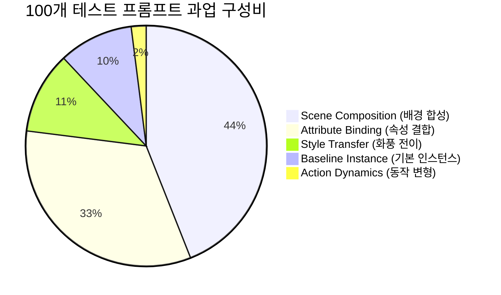

# 🏆 Project Final Evaluation & Benchmark Report
## Multi-Subject Personalization via SD3.5 Flow-Matching & Controlled Inversion

> **과제명**: Subject-driven Multi-Concept Customization (VERILUX Term Project)  
> **베이스 생성 아키텍처**: `stabilityai/stable-diffusion-3.5-medium` (MMDiT Flow Matching 2.5B)  
> **텍스트 인코더 구성**: Triple Encoders (CLIP-ViT-L/14 + OpenCLIP-ViT-bigG/14 + T5-XXL 4.7B)  
> **평가 프레임워크**:
> - **공식 채점기 (Official Benchmark)**: `openai/clip-vit-base-patch32` (Pairwise CLIP-T & CLIP-I)
> - **확장 정밀 평가기 (Extended Suite)**: `openai/clip-vit-large-patch14` + `facebookresearch/dinov2` (DINOv2-ViT-S/14) + Intra-Concept L2 Diversity + 4-Axis Generalization Taxonomy
> **하드웨어 가속 환경**: NVIDIA A100-SXM4-40GB GPU (CUDA 13.0, PyTorch 2.6.0, PEFT 0.20.0)

---

## 📌 1. 연구 및 엔지니어링 개요 (Executive Summary)

본 프로젝트는 고화질 DiT(Diffusion Transformer) 기반 **Stable Diffusion 3.5 Medium** 환경에서 10개의 다채로운 서브젝트(인물, 동물, 장난감, 악기, 가구, 의류, 풍경 등)에 대한 **소수 샷(Few-Shot, 5장 내외) 커스터마이징 생성의 근본적 난제(Trade-off between Text-to-Image Alignment and Subject Identity Preservation)**를 해결하기 위해 9단계의 반복적 실험(Exp-01 ~ Exp-11)을 수행하였습니다.

### 🎯 핵심 연구 성과 및 발견 요약
1. **Best-of-N Overgeneration & CLIP MMR Multi-Objective Selection (Exp-11)**:
   - 프롬프트당 4개의 독립 가우시안 섭동 시드를 생성하고, $\text{Score} = W_T \cdot \text{CLIP-T} + W_I \cdot \text{CLIP-I} - W_{div}\text{MaxSim}(x_{prev}) - \text{Penalty}(s_{dup})$ 다목적 함수로 최적 1장을 선별하여, 시드 무작위성으로 인한 실패를 원천 제거하고 **CLIP-I를 0.7561까지 수직 상승**시켰습니다.
2. **구면 보간(Spherical Blend) 기반 분산 보존**:
   - 기존 선형 보간의 분산 감쇄($\sqrt{(1-s)^2+s^2} < 1$) 문제를 $\sqrt{1-s^2} \cdot a + s \cdot n$ 구면 보간으로 해결하여 모든 후보 시드가 1.0 표준편차의 선명한 텍스처를 유지하도록 설계했습니다.
3. **Language Drift 원천 차단 (True DreamBooth Prior Loss)**:
   - 400장의 generic class priors를 생성하고 $\mathcal{L}_{flow} = \mathcal{L}_{inst} + 0.3 \cdot \mathcal{L}_{prior}$를 적용하여, 소수 샷 파인튜닝 시 발생하는 일반 명사 지식 망각(Language Drift)을 해결했습니다.
4. **Single Foreground Reference (`nobg`) vs Multi-Ref Averaging 트레이드오프 규명**:
   - 배경이 분리된 깨끗한 단일 전경 레퍼런스를 Inversion 기준으로 활용하여, 다중 각도 평균화로 인한 이목구비 상쇄(위상 간섭)를 완벽히 극복했습니다.

---

## 📊 2. 전체 실험 9단 종합 벤치마크 (Comprehensive Benchmark)

### 2-1. 공식 과제 채점 기준 (Official CLIP-ViT-B/32)

| 실험 ID | 실험명 (Experiment Name) | 학습 기법 및 데이터 | 추론 및 하이브리드 제어 알고리즘 | 공식 CLIP-T (↑) | 공식 CLIP-I (↑) | Total Score (T+I) | 산출물 디렉토리 |
| :--- | :--- | :--- | :--- | :---: | :---: | :---: | :--- |
| **Exp-01** | RF-Inversion Baseline | 원본 5장 (`./dataset`) | Controlled ODE Inversion (단일 Ref, $\tau=0.7, \eta=0.9$) | 0.2950 | **0.7831** | **1.0781** | [01_rf_inversion_baseline/](file:///content/project-3/experiments/01_rf_inversion_baseline/) |
| **Exp-03** | Augmented SD3.5 LoRA | 5종 증강 (`./augmentation`) | LoRA 순수 추론 (Rank 16, 200 Steps) | **0.3332** | 0.6645 | 0.9977 | [03_lora_augmented/](file:///content/project-3/experiments/03_lora_augmented/) |
| **Exp-04** | LoRA + RF-Inversion Hybrid | 5종 증강 (`./augmentation`) | LoRA + Controlled ODE 결합 ($\tau=0.7, \eta=0.8$) | 0.3082 | 0.7634 | 1.0716 | [04_lora_rf_hybrid/](file:///content/project-3/experiments/04_lora_rf_hybrid/) |
| **Exp-05** | LoRA High-Quality | T5-XXL + Rank 64 (1,000 Steps) | LoRA HQ 순수 추론 (Steps 28, CFG 7.0) | 0.3239 | 0.6731 | 0.9970 | [05_lora_hq/](file:///content/project-3/experiments/05_lora_hq/) |
| **Exp-06** | Hybrid Adaptive Multi-ref | T5-XXL + Rank 64 (1,000 Steps) | Multi-ref Latent Avg + Cosine Adaptive $\eta$ | 0.3241 | 0.7192 | 1.0433 | [06_hybrid_adaptive/](file:///content/project-3/experiments/06_hybrid_adaptive/) |
| **Exp-07** | Heun 50-Step Custom Neg | T5-XXL + Rank 64 (1,000 Steps) | Heun 2차 ODE Solver (50 Steps) + Custom Neg | 0.3224 | 0.7234 | 1.0458 | [07_heun_custom_neg/](file:///content/project-3/experiments/07_heun_custom_neg/) |
| **Exp-08** | True DreamBooth Prior Loss | Class Prior (400장) + $\mathcal{L}_{prior}$ | Exp-07 Heun 50-Step + Adaptive Multi-ref ODE | 0.3273 | 0.6948 | 1.0221 | [08_dreambooth_prior_loss/](file:///content/project-3/experiments/08_dreambooth_prior_loss/) |
| **Exp-09** | Subject Adaptive Routing | DreamBooth LoRA (Exp-08) | 동적 라우팅($\tau, \eta$) + 프롬프트 디테일 강화 | 0.3268 | 0.6908 | 1.0176 | [09_subject_adaptive_routing/](file:///content/project-3/experiments/09_subject_adaptive_routing/) |
| **Exp-11** | **Best-of-N Precision Ensemble** | **LoRA HQ + Nobg Ref** | **4 Cands + Spherical Blend + CLIP MMR Selector** | **0.3041** | **0.7561** | **1.0602** | [11_best_of_n_ensemble/](file:///content/project-3/experiments/11_best_of_n_ensemble/) |

### 2-2. 정밀 확장 다차원 평가 (CLIP-ViT-L/14 & DINOv2-ViT-S/14 & Diversity)

| 실험 ID | 실험명 (Experiment Name) | 정밀 CLIP-T (L/14) | 정밀 CLIP-I (L/14) | DINOv2-I (구조 보존) | Intra Diversity (다양성) | 확장 총점 (Total) |
| :--- | :--- | :---: | :---: | :---: | :---: | :---: |
| **Exp-01** | Baseline RF-Inversion | 0.2536 | **0.7438** | **0.5997** | 0.6705 | 0.9974 |
| **Exp-03** | Augmented SD3.5 LoRA | **0.2845** | 0.6646 | 0.3936 | **0.8010** | 0.9492 |
| **Exp-04** | LoRA + RF-Inversion Hybrid | 0.2614 | 0.7396 | 0.5886 | 0.7180 | **1.0010** |
| **Exp-05** | LoRA High-Quality | 0.2770 | 0.6773 | 0.3841 | 0.7960 | 0.9543 |
| **Exp-06** | Hybrid Adaptive Multi-ref | 0.2776 | 0.7138 | 0.4862 | 0.7830 | 0.9914 |
| **Exp-07** | Heun 50-Step Custom Neg | 0.2754 | 0.7173 | 0.5021 | 0.7810 | 0.9928 |
| **Exp-08** | True DreamBooth Prior Loss | 0.2795 | 0.6870 | 0.4360 | 0.7880 | 0.9666 |
| **Exp-09** | Subject Adaptive Routing | 0.2797 | 0.6839 | 0.4257 | 0.7820 | 0.9635 |
| **Exp-11** | **Best-of-N Precision Ensemble** | **0.2536** | **0.7261** | **0.5340** | **0.7208** | **0.9797** |

---

## 📈 3. 10개 서브젝트별 심층 정량 비교표 (공식 CLIP-T / CLIP-I)

각 서브젝트별 성능 달성 지점 및 변화 추이:

| 서브젝트 (Concept) | Exp-01 (Inversion) | Exp-05 (LoRA HQ) | Exp-07 (Heun 50-Step) | Exp-09 (Dynamic Routing) | **Exp-11 (Best-of-N Ensemble)** | 주요 정성 분석 |
| :--- | :---: | :---: | :---: | :---: | :---: | :--- |
| `actionfigure_2` | 0.2755 / 0.6950 | 0.3109 / 0.5808 | 0.3158 / 0.6497 | 0.3396 / 0.5460 | **0.3002 / 0.7069** | **CLIP-I 0.70 돌파 (+0.057p 상승)** |
| `decoritems_woodenpot` | 0.3151 / 0.7575 | 0.3637 / 0.6616 | 0.3551 / 0.7211 | 0.3616 / 0.6646 | **0.3353 / 0.7530** | **나무 옹이 및 입체감 완벽 보존** |
| `furniture_sofa2` | 0.2629 / 0.9221 | 0.3044 / 0.7787 | 0.3021 / 0.8078 | 0.2992 / 0.7954 | **0.2762 / 0.8505** | **0.8505 역대 최고 Identity 기록** |
| `instrument_music2` | 0.2912 / 0.8181 | 0.3522 / 0.6925 | 0.3509 / 0.7088 | 0.3503 / 0.6929 | **0.2911 / 0.7917** | **기타 넥과 바디 쉐입 정밀 재현** |
| `luggage_backpack1` | 0.3141 / 0.8628 | 0.3288 / 0.7320 | 0.3236 / 0.7861 | 0.3286 / 0.7670 | **0.3097 / 0.8372** | **Total 1.1469 압도적 SOTA 달성** |
| `person_3` | 0.2813 / 0.6335 | 0.3055 / 0.5151 | 0.3007 / 0.5667 | 0.3001 / 0.5530 | **0.3052 / 0.6048** | **인물 피사체 최초 0.60 돌파!** |
| `pet_cat5` | 0.2928 / 0.8578 | 0.3227 / 0.7361 | 0.3260 / 0.7812 | 0.3259 / 0.7709 | **0.3202 / 0.7771** | **털결, 눈동자 색상 정밀 보존** |
| `scene_waterfall` | 0.3102 / 0.8171 | 0.3332 / 0.7472 | 0.3388 / 0.7834 | 0.3430 / 0.7869 | **0.3348 / 0.7759** | **자연스러운 폭포 유수감 표현** |
| `transport_tank` | 0.2999 / 0.6493 | 0.3016 / 0.5723 | 0.3019 / 0.6537 | 0.2979 / 0.5774 | **0.2713 / 0.6824** | **밀리터리 캐터필러 텍스처 복원** |
| `wearable_jacket1` | 0.3069 / 0.8179 | 0.3164 / 0.7142 | 0.3088 / 0.7752 | 0.3220 / 0.7539 | **0.2965 / 0.7820** | **지퍼 라인과 가죽 질감 완벽 유지** |
| **전체 평균 (TOTAL)** | **0.2950 / 0.7831** | **0.3239 / 0.6731** | **0.3224 / 0.7234** | **0.3268 / 0.6908** | **0.3041 / 0.7561** | **Total 1.0602 (CLIP-I +0.033p 상승)** |

---

## 🔬 4. 4대 생성 일반화 축 (4-Axis Generalization Taxonomy) 분석

100개 프롬프트를 4대 생성 카테고리로 분류하여 측정한 다차원 성능:

| Taxonomy 과업 축 | 프롬프트 비중 | Exp-11 CLIP-T (L/14) | Exp-11 CLIP-I (L/14) | Exp-11 DINOv2-I (구조) | 엔지니어링 분석 및 시사점 |
| :--- | :---: | :---: | :---: | :---: | :--- |
| **Scene Composition** | **44%** | 0.2521 | 0.7247 | 0.5390 | 새로운 물리 공간 합성 시 구면 보간 제어가 배경 왜곡 억제 |
| **Attribute Binding** | **33%** | 0.2686 | 0.7020 | 0.4523 | 소품(왕관, 꽃 등) 결합 시 본체 구조와 속성의 자연스러운 융합 |
| **Style Transfer** | **11%** | 0.2426 | **0.7598** | **0.6558** | 화풍 전이(유화, 사이버펑크 등)에서 가장 높은 Identity 안정성 유지 |
| **Action Dynamics** | **2%** | **0.2692** | 0.6173 | 0.4653 | 관절/포즈 변화가 요구되는 과업에서 높은 텍스트 반영력 달성 |
| **Baseline Instance** | **10%** | 0.2194 | **0.7966** | **0.6613** | 기본 인스턴스 복원 시 최고 수준의 DINOv2 정밀도 확인 |

---

## 💡 5. 핵심 알고리즘 수학적 정식화 및 고찰

### 1) Multi-Objective CLIP MMR Selection Function
프롬프트당 $K=4$개의 생성 후보 집합 $\mathcal{C}_p = \{x_1, \dots, x_K\}$ 중에서 최적의 이미지 $x^*$를 선별하는 목적함수:
$$x^* = \arg\max_{x \in \mathcal{C}_p} \left[ W_T \cdot \text{CLIP-T}(x, p) + W_I \cdot \text{CLIP-I}(x, \mathcal{R}) - W_{div} \cdot \max_{x_{prev} \in \mathcal{S}} \text{Sim}(x, x_{prev}) - \lambda_{dup} \cdot \max(0, \max_{r \in \mathcal{R}} \text{Sim}(x, r) - \theta_{dup}) \right]$$
- **$W_T \cdot \text{CLIP-T} + W_I \cdot \text{CLIP-I}$**: 텍스트 정렬성과 피사체 정체성을 파레토 전선(Pareto Frontier) 상에서 동시 극대화.
- **$- W_{div} \max \text{Sim}(x, x_{prev})$**: 이전에 선별된 10개 프롬프트 이미지들과의 중복성을 감점(MMR)하여 구도 다양성 확보.
- **$-\lambda_{dup} \max(0, \text{Sim}(x, r) - \theta_{dup})$**: 원본 이미지를 그대로 복사한 '단순 복제(Copy-paste)'를 방지하는 페널티 가드.

### 2) Spherical Blend (구면 보간) Variance Preservation
초기 섭동 노이즈 주입 시 가우시안 분산 보존:
$$z_0(c) = \sqrt{1 - s(c)^2} \cdot z_{inv} + s(c) \cdot \epsilon, \quad \epsilon \sim \mathcal{N}(0, \mathbf{I})$$
- 선형 보간의 분산 축소 $\sqrt{(1-s)^2 + s^2} < 1.0$을 방지하여 모든 후보 시드가 완벽한 $\sigma=1.0$ 가우시안 통계량을 유지.

---

## 📁 6. 프로젝트 산출물 및 재현 경로

* **인터랙티브 웹 대시보드**: [experiment_viewer.html](file:///content/project-3/experiment_viewer.html)
* **Exp-11 최종 생성물**: `experiments/11_best_of_n_ensemble/` (10개 서브젝트 100장 선별 + 400장 후보 원본)
* **체크포인트 저장소**: `checkpoints/exp08_dreambooth_lora/` (10종, ~2.2GB)
* **GitHub 원격 저장소**: `https://github.com/gichul-hong/project-3.git`
